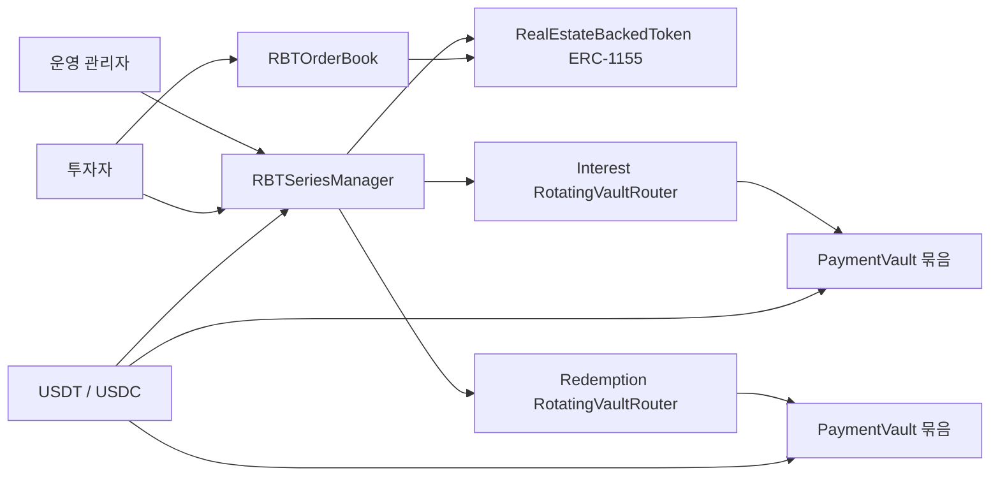
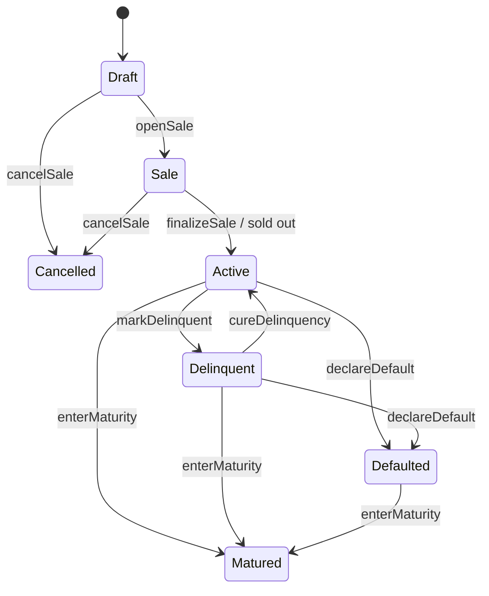

# 아키텍처 문서

## 1. 목표

이 시스템은 부동산 기반 RWA 상품을 `차수(series)` 단위로 발행하고, 다음 생애주기를 온체인으로 관리하기 위해 설계되었습니다.

1. 차수 생성
2. 스테이블 코인 모집
3. 모집 완료 후 발행 활성화
4. 이자 재원 예치 및 유저별 이자 청구
5. 유저 간 2차 거래
6. 만기/디폴트 처리
7. 상환 재원 예치 및 NFT 버닝 상환

## 2. 핵심 컨트랙트

### 2.1 RealEstateBackedToken

- ERC-1155 기반 RBT 토큰 본체
- 토큰 ID 하나가 부동산 한 차수를 의미
- 예: `A-1차 = tokenId 1`, `A-2차 = tokenId 2`

### 2.2 RBTSeriesManager

- 차수 생성과 운영 상태를 총괄
- 판매 기간 관리
- 투자금 escrow 보관 및 모집 완료 후 발행사 treasury 이체
- 이자 누적/청구 정산
- 연체, 디폴트, 만기, 상환 로직 관리

### 2.3 RotatingVaultRouter + PaymentVault

- 이자금/상환금을 보관하는 트레저리 계층
- 실제 자산은 `PaymentVault`에 보관
- `RotatingVaultRouter`는 활성 볼트를 가리키며, 예전 볼트 자산도 계속 지급 가능
- 운영 중 새 볼트를 추가해도 기존 RBT 투자자의 청구권이 끊기지 않음

### 2.4 RBTOrderBook

- 2차 거래용 온체인 오더북
- Ask: 판매자가 RBT를 escrow에 맡김
- Bid: 구매자가 스테이블 코인을 escrow에 맡김
- 체결 시 자산과 대금을 서로 교환

### 2.5 WFTToken

- ERC-20 + Permit + Votes
- 락업 일정, 에어드랍, 거버넌스 투표를 지원

### 2.6 USDRToken

- 6 decimals ERC-20 스테이블 코인
- 민팅/소각/정지 가능한 기본 스테이블 토큰

## 3. 구성도

## 4. RBT 상태 머신

## 5. 자금 흐름

### 5.1 1차 판매

1. 운영자가 차수를 생성한다.
2. 투자자는 USDT/USDC로 `buy`를 호출한다.
3. RBT가 즉시 민팅되지만, 시리즈 상태는 `Sale`로 유지된다.
4. 판매량이 다 찼거나 판매 종료일이 지나면 `finalizeSale`로 `Active`가 된다.
5. escrow에 모인 스테이블 코인이 `issuerTreasury`로 이동한다.

### 5.2 이자 지급

1. 재단 또는 운영 treasury가 `fundInterest`로 이자 재원을 예치한다.
2. 시점별 누적 이자 단가가 `accInterestPerShare`에 기록된다.
3. 유저는 `claimInterest` 또는 `claimInterestBatch`로 직접 받아간다.
4. 중간에 RBT를 전송하면 누적 부채값을 재계산해 권리가 분리된다.

### 5.3 2차 거래

1. 시리즈가 `Active`이고 `secondaryTradingEnabled=true`일 때만 거래 가능
2. Ask는 RBT를 escrow, Bid는 스테이블 코인을 escrow
3. Bid 체결 시 NFT는 항상 bid maker에게 이동하도록 고정되어 있다.

### 5.4 만기/디폴트 상환

1. 정상 만기 또는 디폴트 이후 `enterMaturity`
2. 운영자가 `enableRedemption`으로 상환 재원을 적립
3. 유저가 `redeem` 호출
4. RBT가 burn되고 대응하는 USDT/USDC가 지급된다.

## 6. 역할 분리

| 역할                       | 설명                                                 |
| -------------------------- | ---------------------------------------------------- |
| `DEFAULT_ADMIN_ROLE`       | 권한 부여의 최상위 관리자                            |
| `OPERATOR_ROLE`            | 시리즈 생성, sale open, metadata 수정, maturity 진입 |
| `TREASURY_FUNDER_ROLE`     | 이자/상환 자금 적립                                  |
| `CLAIMS_MANAGER_ROLE`      | router가 manager에게 지급 권한을 허용할 때 사용      |
| `DELINQUENCY_MANAGER_ROLE` | 연체/디폴트 관리                                     |
| `LOCK_MANAGER_ROLE`        | WFT 락 생성/해제                                     |
| `AIRDROP_ROLE`             | WFT 마케팅 분배                                      |
| `MINTER_ROLE`              | WFT/USDR 민팅                                        |
| `PAUSER_ROLE`              | 토큰 일시 정지                                       |

## 7. 스케일 확장 전략

1. `RBTSeriesManager`는 여러 시리즈를 한 컨트랙트에서 관리합니다.
2. 오더북은 교체 가능한 독립 모듈입니다.
3. 볼트 라우터는 새 볼트를 추가해 키 분리/재배포에 대응합니다.
4. 차수가 많아질 경우, `tokenId` 네이밍과 메타데이터 인덱싱은 오프체인 백엔드가 맡고 온체인은 최소 상태만 보관하도록 유지했습니다.
