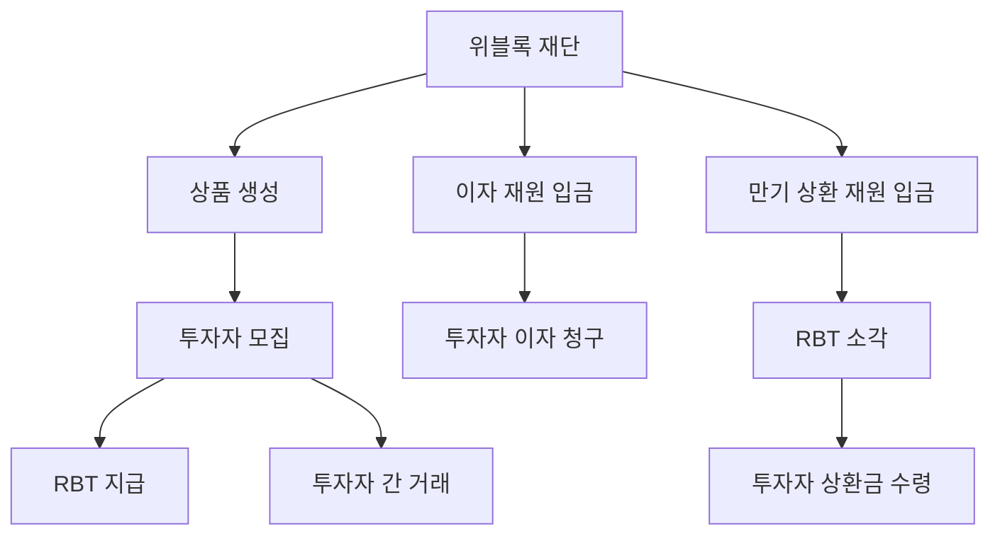

# 비개발자용 설명서

이 문서는 블록체인을 잘 모르는 사람도 위블록의 새 상품 구조를 이해할 수 있도록 쉽게 설명한 문서입니다.

## 1. 이 시스템이 하는 일

쉽게 말하면, 위블록이 어떤 부동산 상품을 잘게 나눠서 투자권을 판매하고, 이후 이자와 만기 정산까지 자동으로 처리하는 시스템입니다.

예를 들어 `A 부동산 1차 상품`을 만든다고 가정하면:

1. 위블록이 판매 수량과 가격을 정합니다.
2. 투자자는 USDT/USDC로 조각을 삽니다.
3. 투자자는 `RBT`라는 권리 토큰을 받습니다.
4. 상품이 운영되면서 이자가 생기면, 투자자는 본인 보유 수량만큼 직접 청구합니다.
5. 나중에 상품이 종료되면, 투자자는 RBT를 반납하고 원금/상환금을 받습니다.

## 2. 토큰 세 가지

### 2.1 RBT

- 부동산 상품의 조각 투자 권리
- 한 부동산 안에서도 `A-1차`, `A-2차`처럼 나눠 발행 가능
- 투자자끼리 다시 거래 가능

### 2.2 WFT

- 위블록 재단 토큰
- 거버넌스, 보상, 에어드랍에 사용
- 일부 물량은 락업 가능

### 2.3 USDR

- 위블록이 발행하는 스테이블 코인
- 일반적인 디지털 달러 토큰처럼 사용

## 3. 구성도

## 4. 돈이 움직이는 방식

### 판매할 때

- 투자자가 USDT/USDC를 냅니다.
- 돈은 잠시 스마트컨트랙트에 모입니다.
- 상품 모집이 끝나면 그 돈이 위블록 또는 발행사 계정으로 넘어갑니다.

### 이자 줄 때

- 위블록이 이자 지급용 금액을 넣어둡니다.
- 투자자는 앱에서 직접 `이자 받기`를 누릅니다.
- 많이 가진 사람이 더 많이 받습니다.

### 만기 때

- 위블록이 상환용 금액을 넣어둡니다.
- 투자자는 본인 토큰을 태우고 상환금을 받습니다.

## 5. 왜 볼트를 따로 두는가

이자금과 상환금을 보관하는 지갑을 하나로 계속 쓰면 보안상 불리할 수 있습니다. 그래서 이 시스템은 지급용 보관소(vault)를 여러 개 둘 수 있게 만들었습니다.

장점:

1. 새 지갑으로 교체 가능
2. 예전 지갑에 돈이 남아 있어도 계속 지급 가능
3. 운영 사고가 났을 때 분리 대응 가능

## 6. 운영자가 할 수 있는 일

1. 새 상품 차수 만들기
2. 판매 시작하기
3. 판매 종료 후 상품 활성화
4. 이자 지급금 넣기
5. 연체 표시 / 연체 해제
6. 디폴트 선언
7. 만기 처리
8. 상환금 넣기
9. WFT 에어드랍 및 락업 관리

## 7. 투자자가 할 수 있는 일

1. USDT/USDC로 상품 투자
2. 본인 지갑에서 RBT 확인
3. 이자 직접 청구
4. 다른 투자자와 RBT 거래
5. 만기 시 상환금 직접 청구

## 8. 꼭 알아야 할 점

- 이 시스템은 투자자 자산 흐름을 코드로 강하게 고정하려고 설계되었습니다.
- 하지만 운영자 권한은 여전히 중요하므로, 실제 서비스에서는 멀티시그와 내부 승인 절차가 꼭 필요합니다.
- 스마트컨트랙트 감사와 실제 운영 프로세스 문서가 함께 있어야 상용 서비스 품질에 가까워집니다.
